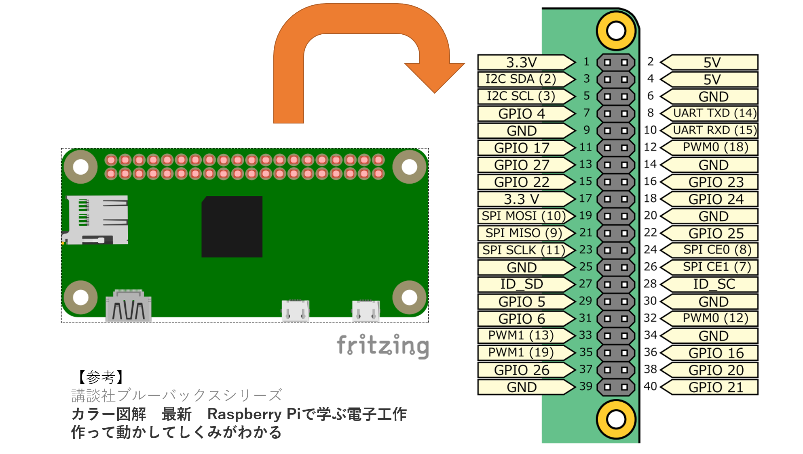
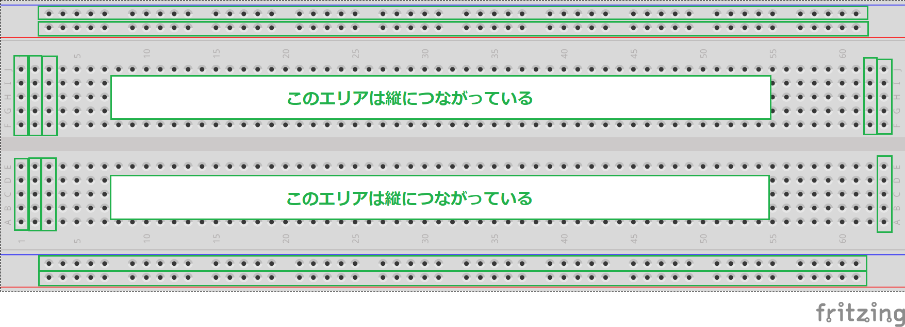
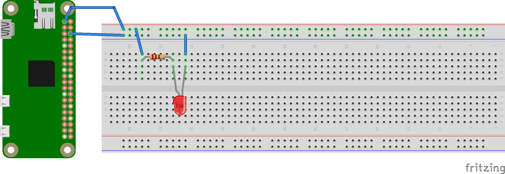
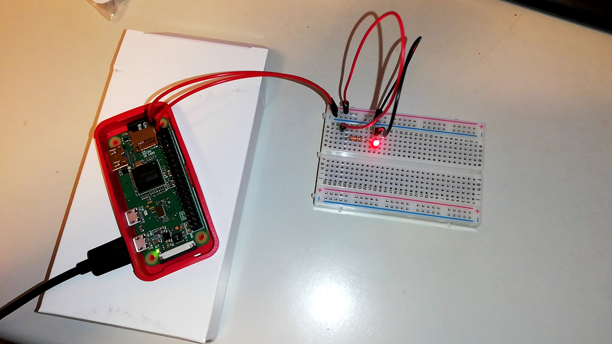
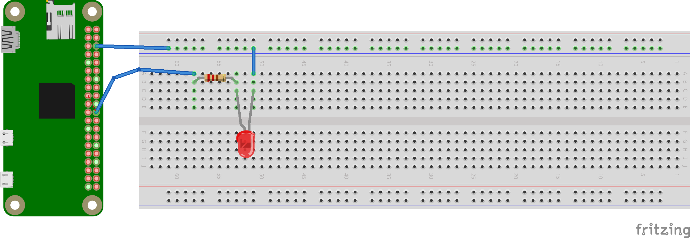
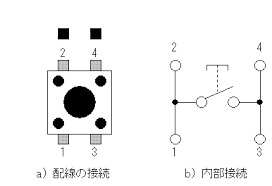
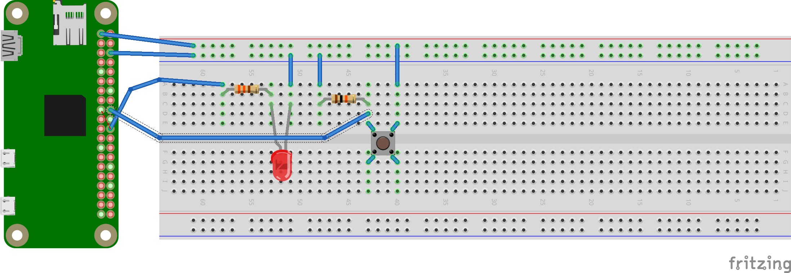

# Raspberry Pi GPIO制御

## Raspberry Pi の GPIOピンヘッダ
Raspberry Pi のGPIOピンヘッダは、Pi2, Pi3, Zeroシリーズ全て共通で以下のような配列になっている

また、Raspberry Pi の電圧は **5V** or **3.3V** になっている



<br/>

## 電気回路の基本
- オームの法則：電流I\[A] = 電圧V\[V] / 抵抗R\[Ω]
- 電圧の基準（0V）となるアース（GND）が必要
- 電源からアースに向かって電流が流れる

```plantuml
title 電気回路の基本

class 電源{
    5V or 3.3V
}
class 抵抗{
    R Ω
}
class アース{
    GND
}

電源-right..>アース: 電流I = 電圧V / 抵抗R
電源->抵抗
抵抗->アース
```

---

```plantuml
title 抵抗がない場合

database 3.3V
node GND
note top: 電流が無限[A]になるため、ショートする

3.3V-right->GND: 電流I = 3.3 / 0 = ∞
```

<br/>

### 簡単なLED回路

#### 一般的な赤色LED
- アノード(+)からカソード(-)の方向に電流が流れると光る
    - 通常、アノード側の端子の方が少し長くなっている
- 10～20mA以内の電流が流れると光る
    - それ以上の電流が流れると壊れる可能性がある
- LEDの両端で1.85V程度の電位差が生じる

#### 回路図設計
```plantuml
title 回路図

class 電源{
    3.3 [V]
}
class 抵抗{
    R [Ω]
    V [V]
}
class LED{
    1.85 [V]
}
class アース{
    GND
}

電源->抵抗
抵抗->LED: 10 [mA] 以内の電流が流れれば、LEDが壊れずに点灯する
LED->アース
電源-right..>アース
```

1. 電源 -> アース : 3.3Vの電位差が生じる
    - 抵抗にかかる電圧V = 3.3 - 1.85 = 1.45 \[V]
2. オームの法則より R = V / I
    - 抵抗R = 1.45 / 0.01(=10mA) = 145 \[Ω]
3. 145Ω以上の抵抗を挟んでやれば正常にLEDが点灯する
    - ただし、抵抗値が大きすぎるとLEDの光が弱くなる
    - 今回は330Ωの抵抗を使うことにした

#### ブレッドボード設計
ブレッドボードはたくさんの穴の開いたボードで、電子部品を差し込んで回路を制作できるようになっている

また、ブレッドボードの内部は、下図の緑で囲んだ部分がつながった構造になっている



そのため、上述した回路設計をブレッドボードで再現すると以下のようになる

なお、Raspberry Pi の電源がついた状態で組み立てて大丈夫だが、3.3V電源ピンとGNDピンが接触すると、ショートして Raspberry Pi が壊れるため、3.3V電源に繋ぐジャンパーワイヤーは最後に差し込むのが無難





写真のように、LEDが点灯したら成功

回路を外すときは、組み立てる時と逆に、3.3V電源ピンのジャンパーワイヤーから外していけば安全

<br/>

## PythonでLEDを点滅させる

### Python準備
Raspbian OSには、デフォルトでPythonがインストールされている

以下は、Raspbian Stretch にデフォルトでインストールされているPythonのバージョン確認例
```
$ python -V
Python 2.7.13

$ python3 -V
Python 3.5.3
```

しかし、GPIO制御に必要なライブラリ等はインストールされていないため、それらを準備する

1. とりあえず現在インストールされているパッケージを最新バージョンに更新しておく
    - 更新するパッケージ数にもよるが、大体10～30分程度かかる
    ```sh
    sudo apt-get update
    sudo apt-get upgrade -y
    sudo apt-get dist-upgrade
    ```
    - `sudo apt-get upgrade`: パッケージ構成を変えない範囲でアップグレードする
    - `sudo apt-get dist-upgrade`: パッケージ構成の変更に追随してアップグレード
2. GPIO制御用のライブラリをインストール
    - 色々なライブラリが公開されているが、ここでは最もスタンダードな**RPi.GPIO**をインストールする
    ```sh
    # Python2用
    sudo apt-get install python-rpi.gpio

    # Python3用
    sudo apt-get install python3-rpi.gpio
    ```

<br/>

### 回路設計

回路は前回のLED回路とほぼ同じだが、電源側を`3.3V`（下図1番目のピン）から`GPIO25`（下図22番目のピン）に変更する


GPIOは"General-purpose input/output"の略で、**汎用入出力**を意味する

すなわち、プログラムで制御可能なピンであり、かつ入力（電圧のON/OFFを検出）にも出力（電圧のON/OFFを発信）にも使えるピンということである

今回使う`GPIO25`ピンは、ONのときは3.3Vの電圧を生じ、OFFのときは電圧がかからない（電流が流れない）ため、回路図のイメージは以下のようになる

```plantuml
title 回路図（GPIO: ON）

class GPIO25{
    ON: 3.3 [V]
}
class 抵抗{
    330 [Ω]
    1.45 [V]
}
class LED{
    1.85 [V]
}
class アース{
    GND
}

GPIO25->抵抗
抵抗->LED: I = 1.45 / 330 ≒ 4.4 [mA] の電流が流れるためLED点灯
LED->アース
GPIO25-right..>アース
```

```plantuml
title 回路図（GPIO: OFF）

class GPIO25{
    OFF: 0 [V]
}
class 抵抗{
    330 [Ω]
    0 [V]
}
class LED{
    0 [V]
}
class アース{
    GND
}

GPIO25->抵抗
抵抗->LED: I = 0 / 330 = 0 [mA] → 電流が流れないためLED消灯
LED->アース
GPIO25-right..>アース
```

これを実際にブレッドボードで組むと以下のようになる



<br/>

### GPIO制御プログラミング
回路を組み、Raspberry Pi とSSH接続したら、プログラムを組んでいく

1. `nano LED_test.py` で、"LED_test.py"というファイルを新規作成してnanoエディタで開く
    - viエディタを使っても良いが、nanoはシンタックスハイライト機能があるため、コードが見やすい
2. 以下のようなプログラムを記述（コメントは無視してOK）
    ```python
    # LED_test.py: LEDを0.5秒おきに点滅させるプログラム
    from RPi import GPIO # GPIO制御用のライブラリ
    from time import sleep

    # GPIOの初期化命令: 最初に一回実行
    ## BCM: 端末の指定方法（GPIO.BOARDもあるが、基本BCMモードで良い）
    GPIO.setup(GPIO.BCM)

    # GPIO25 を出力ピンとしてセットアップ
    ## 端子番号は物理端子番号(Raspberry Pi GPIO図のピン番号)の22ではないため注意
    GPIO.setup(25, GPIO.OUT)

    while True: # ずっと点滅させるためループさせる
        GPIO.output(25, GPIO.HIGH) # GPIO25 から ON の電圧(3.3V)を発信→LED点灯
        sleep(0.5) # 0.5秒待つ
        GPIO.output(25, GPIO.LOW) # GPIO25 から OFF の電圧(0V)を発信→LED消灯
        sleep(0.5) # 0.5秒待つ
        # 以下ループの先頭に戻って繰り返し
    
    # セットアップしたGPIOを全て解放して終了
    GPIO.cleanup()
    ```
3. `sudo python LED_test.py` で、記述したプログラムを実行
    - LEDが0.5秒間隔で点滅すれば成功
4. 上記プログラムは無限ループのため、`Ctrl`+`C`キーを押して強制終了させる
    - この時、ループ中で強制終了するため、`GPIO.cleanup()`が呼ばれず、場合によってはLEDが点灯したまま終了してしまう
    - さらに、次にプログラムを実行しようとすると「チャンネル（ピン）がすでに使用中」という感じの警告メッセージが現れる
5. 強制終了(`Ctrl`+`C`)時にも、`GPIO.cleanup()`が呼び出されるよう、以下のようにプログラムを改良する
    ```python
    # LED_test.py: LEDを0.5秒おきに点滅させるプログラム
    from RPi import GPIO # GPIO制御用のライブラリ
    from time import sleep

    # GPIOの初期化命令: 最初に一回実行
    ## BCM: 端末の指定方法（GPIO.BOARDもあるが、基本BCMモードで良い）
    GPIO.setup(GPIO.BCM)

    # GPIO25 を出力ピンとしてセットアップ
    ## 端子番号は物理端子番号(Raspberry Pi GPIO図のピン番号)の22ではないため注意
    GPIO.setup(25, GPIO.OUT)

    try: # 例外処理に対応
        while True: # ずっと点滅させるためループさせる
            GPIO.output(25, GPIO.HIGH) # GPIO25 から ON の電圧(3.3V)を発信→LED点灯
            sleep(0.5) # 0.5秒待つ
            GPIO.output(25, GPIO.LOW) # GPIO25 から OFF の電圧(0V)を発信→LED消灯
            sleep(0.5) # 0.5秒待つ
            # 以下ループの先頭に戻って繰り返し
    except KeyboardInterrupt: # Ctrl+Cによる強制終了が起こった場合
        pass # 何も実行せず次の処理（GPIO.cleanup()）に移行
    
    # セットアップしたGPIOを全て解放して終了
    GPIO.cleanup()
    ```
6. このプログラムでもう一度 `sudo python LED_test.py` を実行すれば、問題なく強制終了できるはず

#### まとめ
GPIO制御プログラムの基本的な流れは以下の通り
```python
from RPI import GPIO # GPIO制御ライブラリの読み込み

''' GPIOのセットアップ '''
GPIO.setup(GPIO.BCM) # 基本はBCMモードで初期化
GPIO.setup(端末番号, GPIO.OUT or GPIO.IN) # GPIO[n番]を 出力 or 入力 ピンとしてセットアップ
''' ----------------- '''

try:
    while True:
        '''
        メインの処理をここで実行
        '''
except KeyboardInterrupt:
    pass

''' GPIOのクリーンアップ '''
GPIO.cleanup()
''' -----------------   '''
```

<br/>

## LEDをスイッチで制御
タクトスイッチを使い、LEDライトを制御してみる

タクトスイッチは以下のような構造となっている



<br/>

### 回路設計
今回は、`GPIO24`でスイッチのON/OFFを検出し、`GPIO25`でLEDのON/OFFを発信することにする

LEDにON/OFF発信する回路（OUT回路）は前回の回路を流用するが、タクトスイッチの回路（IN回路）は以下のように**プルダウン抵抗**を用いた回路とする

```plantuml
title タクトスイッチON
[+3.3V]-right->[タクトスイッチ]
[タクトスイッチ]-right->[ ]
[ ]-right->[抵抗: 10kΩ]
[抵抗: 10kΩ]-right->[GND]
[ ]-up->[GPIO24]: GPIO24 = 3.3V → "ON"を検知
[ ]-down..>[GND]: 電位差 3.3V, 電流I = 3.3/10,000 = 0.33 [mA] 流れる
```

```plantuml
title タクトスイッチOFF
[+3.3V]-right->[タクトスイッチ]
[タクトスイッチ]-right..[ ]
[ ]-right->[抵抗: 10kΩ]
[抵抗: 10kΩ]-right->[GND]
[ ]-up->[GPIO24]
[GND]..>[GPIO24]: 電圧 0V → "OFF"を検知
```

<br/>

なお、プルダウン抵抗には基本的に、10kΩや100kΩの大きな抵抗を選定する

以下のように、抵抗のない回路やアースしていない回路は、ショートしたりGPIO入力値が不定になったりする

```plantuml
title 抵抗なし＆タクトスイッチON
[+3.3V]-right->[タクトスイッチ]
[タクトスイッチ]-right->[ ]
[ ]-right->[GND]: 電位差 3.3V, 電流I = 3.3/0 = ∞ [A] 流れてショートする
[ ]-up->[GPIO24]: GPIO24 = 3.3V → "ON"を検知
```

```plantuml
title アースなし＆タクトスイッチOFF
[+3.3V]-right->[タクトスイッチ]
[タクトスイッチ]-right..[ ]
[ ]-right->[抵抗: 10kΩ]
[ ]-up->[GPIO24]: 電位差不明 → 入力値不定
```

<br/>

実際にブレッドボードで回路を組んでみると以下のようになる



複雑に見えるが、タクトスイッチのON/OFFを検出する`GPIO24`(IN)回路と、LEDにON/OFFを発信する`GPIO25`(OUT)回路を分けて考えれば比較的わかりやすいはず

<br/>

### Pythonプログラム
プログラムは以下の通り
```python
# LED_switch.py: LEDをスイッチで制御するプログラム
from RPi import GPIO # GPIO制御用のライブラリ
from time import sleep

# GPIOの初期化命令: 最初に一回実行
GPIO.setup(GPIO.BCM)

# GPIO24 を入力ピンとしてセットアップ
GPIO.setup(24, GPIO.IN)

# GPIO25 を出力ピンとしてセットアップ
GPIO.setup(25, GPIO.OUT)

try: # 例外処理に対応
    while True:
        if GPIO.input(24) == GPIO.HIGH:　# GPIO24 が ON の電圧(3.3V)を受信した場合
            GPIO.output(25, GPIO.HIGH) # GPIO25 から ON の電圧(3.3V)を発信→LED点灯
        else: # GPIO24 が OFF の電圧(0V)を受信した場合
            GPIO.output(25, GPIO.LOW) # GPIO25 から OFF の電圧(0V)を発信→LED消灯
        
        sleep(0.01) # Raspberry Pi のCPUに過負荷がかかるのを防ぐため、10ミリ秒だけ待機

except KeyboardInterrupt: # Ctrl+Cによる強制終了が起こった場合
    pass # 何も実行せず次の処理（GPIO.cleanup()）に移行

# セットアップしたGPIOを全て解放して終了
GPIO.cleanup()
```

`sudo python LED_switch.py`を実行して、想定通りに動作すれば成功
