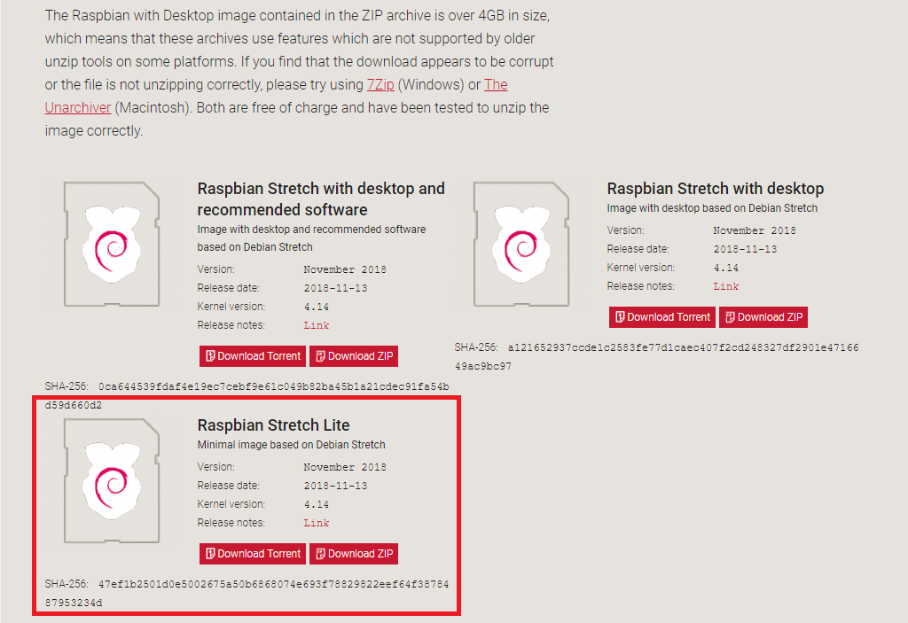
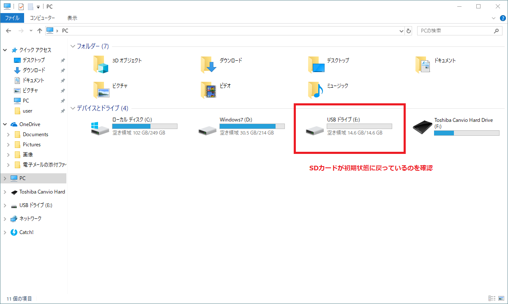
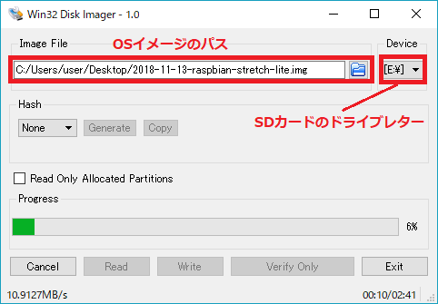
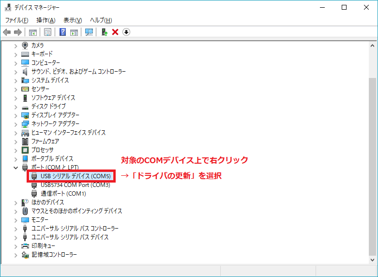
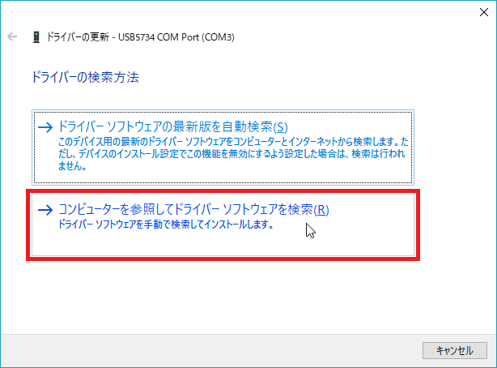
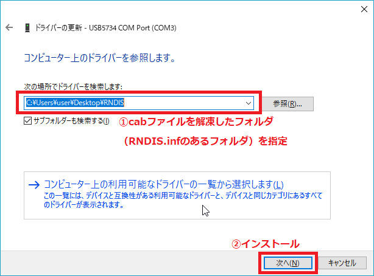
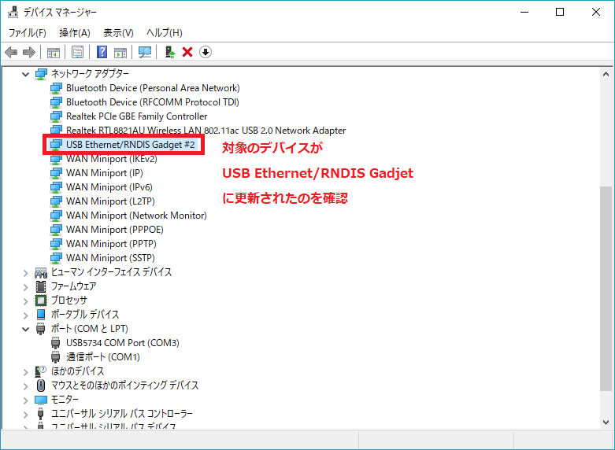
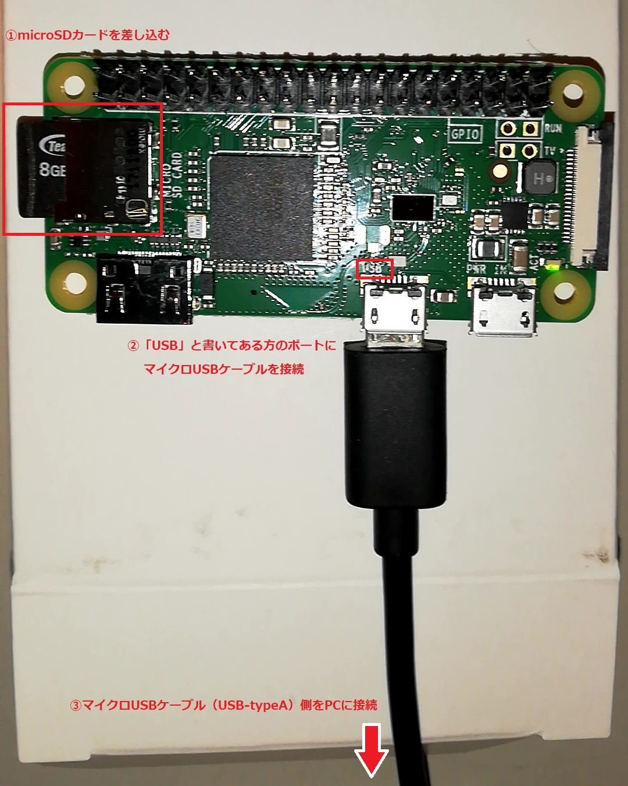
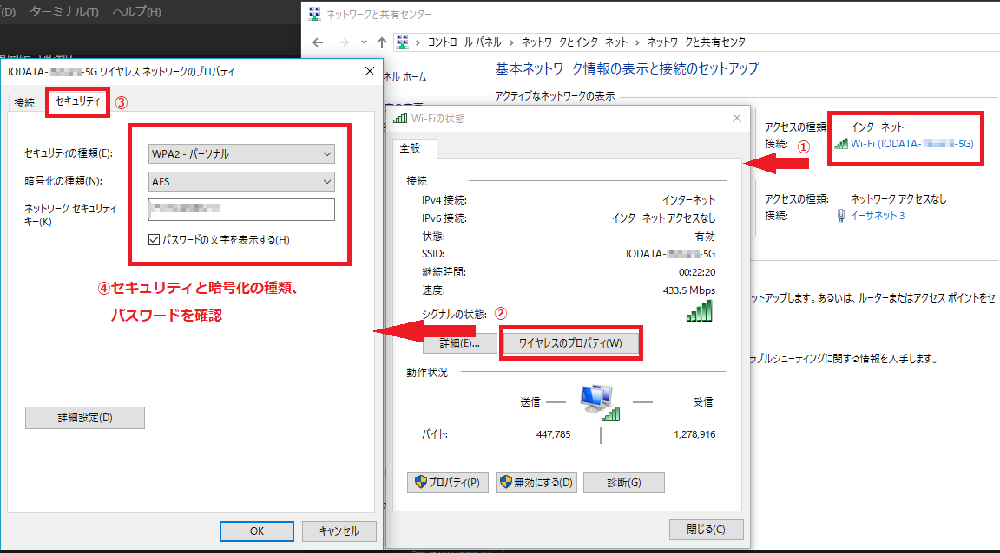
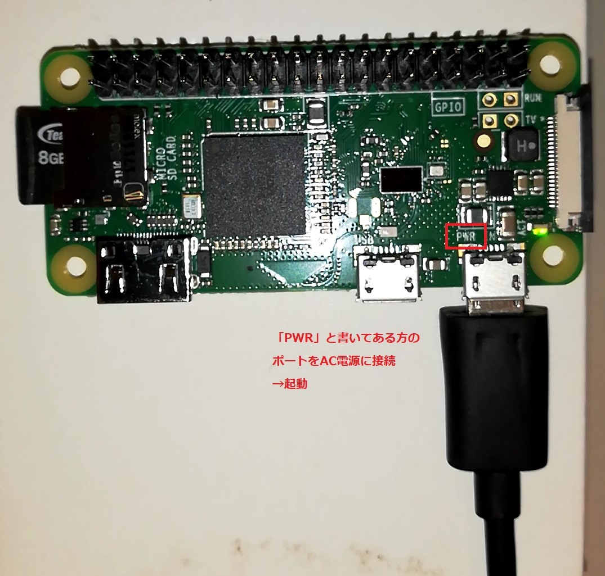

# Raspberry Pi 入門

## Raspberry Pi 比較

### クレカサイズ Raspberry Pi(4種類) ※2018年12月時点
|モデル|発売|値段|メモリー|CPU|USBポート|ディスプレイポート|有線LAN|無線LAN|GPIO|ストレージ|消費電力(参考)|
|:--|:--|:--|:--|:--|:--|:--|:--|:--|:--|:--|:--|
|Pi Model B+|2014/7|\$25|512MB|700MHz|4|HDMI|あり|なし|40pin|microSD|600mA(3W)|
|Pi2 Model B|2015/2|\$35|1GB|4コア<br/>900MHz|4|HDMI|あり|なし|40pin|microSD|900mA(4.5W)|
|Pi3 Model B|2016/3|\$35|1GB|4コア<br/>1.2GHz(64bit)|4|HDMI|あり|あり<br/>2.4Ghz|40pin|microSD|7W|
|Pi3 Model B+|2018/3|\$35|1GB|4コア<br/>1.4GHz(64bit)|4|HDMI|あり|あり<br/>2.4+5Ghz|40pin + PoE|microSD|不明|

<br/>

### フリスクサイズ Raspberry Pi(3種類) ※2018年12月時点
|モデル|発売|値段|メモリー|CPU|USBポート|ディスプレイポート|有線LAN|無線LAN|GPIO|ストレージ|消費電力(参考)|
|:--|:--|:--|:--|:--|:--|:--|:--|:--|:--|:--|:--|
|Pi Zero|2015/12|\$5|512MB|1GHz|1(micro)|microHDMI|なし|なし|40pin|microSD|0.5-0.7W|
|Pi Zero W|2017/2|\$10|512MB|1GHz|1(micro)|microHDMI|なし|あり|40pin|microSD|不明|
|Pi Zero WH|2018/1|\$14|512MB|1GHz|1(micro)|microHDMI|なし|あり|40pin<br/>ピンヘッダ付き|microSD|不明|

<br/>

### 選定方法
1. クレカサイズ Raspberry Pi, Pi2, Pi3シリーズ
    - サーバー、コンピューターとして使用する場合は、スペックの高い Pi2, 3 を選定するのが良い
    - USB, HDMIがそのまま接続可能で、無線LAN標準搭載の Pi3 Model B, Pi3 Model B+ がおすすめ
    - Pi3 Model B+ は64bit OS搭載可能でBluetoothにも対応しているため、資金に余裕があるならこれを買っておけば何でもできる
    - Zeroシリーズと違い、USB-OTG機能に対応していないため、セットアップにはPC以外にも周辺機器が必要
2. フリスクサイズ Raspberry Pi Zeroシリーズ
    - とりあえず電子工作を始めてIoTデバイスを作ってみたいだけならば、Pi Zero WH がおすすめ
    - Pi Zero WH 以外のZeroシリーズは、GPIOピンヘッダを自分で半田付けしなければならないため敷居が高い
    - Pi Zeoシリーズは、キーボードやマウス、ディスプレイと接続するために変換アダプターとUSBハブの購入が必須となる
    - Pi Zeroシリーズは、USB-OTG機能が使えるため、マイクロUSBケーブル一本でPCと繋いでセットアップ可能

### 必要機材
1. Raspberry Pi 本体
    - 上記のスペック表を参考に、用途に合わせて購入
    - 最近は、最低限必要なケーブルやmicroSDカード等をパックしたスターターキットも販売しているため、面倒を嫌うのであればそれを買うのが良い
2. マイクロUSBケーブル(tybe-B)＋AC電源
    - 一般的なAndroidスマホ用の充電ケーブルを持っていればそれでもOKだが、データ転送可能なケーブルがあるとベスト
        - PCからSSH接続してセットアップする場合は、マイクロUSBケーブル（microUSB-tybeB <-> USB-typeA）で接続して、データのやり取りをすることになる
    - Pi3系は、必要電流が2～2.5A以上とされているため、それに応じたAC電源を購入すること
3. キーボード、マウス、ディスプレイ
    - PCからSSH接続してセットアップする場合は不要
    - 無線マウス等だと相性による不具合が起こる可能性があるため、有線接続を推奨
    - Zeroシリーズを使うなら、必要に応じて変換アダプターも購入すること
4. microSDカード
    - OSをインストールするためのmicroSDカードが必要
    - ストレージ容量の推奨は8GB～32GB（16GBあれば大抵大丈夫）
    - 相性による不具合が起こりやすいため、動作報告のあるものを選定するのが無難
5. SDカードリーダー
    - OSのインストールはPCで行うため、PC用のSDカードリーダーが必要
    - OSインストール済みのSDカードとセットになっているスターターキットもあるが、OSのアップデートに時間をとられる可能性があるため、PCで最新バージョンをダウンロードしてインストールする方が楽

---

## Raspberry PI セットアップ

以降の説明は筆者環境（PC: Windows10 Pro 1803 64bit、自宅: 無線LAN環境あり）に準拠

セットアップは、<span style="color:red">PC側からSSH接続して行う方法</span>を採用

必要な機材は以下の通り
- Raspberry Pi Zero WH
    - とりあえず入門してみるなら、Pi Zero WH のコスパが一番良いと思われる
    - 無印ZeroにはWi-Fi内蔵されていないため、ドングルとアダプターを別途購入する
- microSDカード（8GB以上を推奨）
    - 筆者は、TEAMジャパン製microSDHC（8GB）を購入
- マイクロUSBケーブル（microUSB-typeB <-> USB-typeA）
    - データ転送ができるタイプのものが必要
    - PCから給電しつつセットアップできるため、最悪AC電源はなくてもOK
- PC（Windows10 1709(Fall Creators Update)以上）
    - Windows10標準のSSHクライアントを使いたい場合、Fall Creators Update以降のWindows10が必要
- SDカードリーダー
    - microSDカードをPCで読み書きするために必要
- 無線LAN（Wi-Fi）環境
    - Raspberry Pi にあまりケーブルをつけたくないので、無線LAN接続を推奨

<br/>

### OSのインストール

#### OSのダウンロード
1. 本家ダウンロードサイト（ https://www.raspberrypi.org/downloads/ ）から、必要なOSイメージをダウンロード
2. 色々あるが、今回は最もスタンダードな **Raspbian** OSを選択
3. ディスプレイレスでセットアップするため、デスクトップイメージは不要なので、最もシンプルな **Raspbian Stretch Lite** をダウンロード
    - BitTorrentクライアントを持っているなら、Torrentダウンロードした方が速い
    - Stretchはバージョンの名前（2018年12月現在）。以前はJessieだった
    - Lite版のダウンロードサイズは350MB程度だが、フルパッケージだと1.8GBもある
    
4. ダウンロードしたZipファイルを解凍


<br/>

#### OSインストール済みのSDカードをフォーマットする
間違えてOSインストール済みのSDカードが同梱されたスターターキットを購入してしまったため、一度フォーマットする（本末転倒）

1. 管理者権限でコマンドプロンプトを起動
2. `diskpart`コマンド実行
    ```
    C:\WINDOWS\system32> diskpart

    Copyright (C) Microsoft Corporation.
    コンピューター: ＊＊＊＊＊＊

    DISKPART>
    ```
3. `list disk`でPCに接続されているストレージを一覧表示
    ```
    DISKPART> list disk
    
    ディスク      状態           サイズ   空き   ダイナ GPT
    ###                                        ミック
    ------------  -------------  -------  -------  ---  ---
      ディスク 0    オンライン           465 GB  3072 KB        *
      ディスク 1    オンライン          1863 GB      0 B
      ディスク 2    オンライン            14 GB  3072 KB
    ```
4. SDカードと思われるストレージを`select disk <ディスク番号>`で選択
    - 上記の場合、「ディスク 2」がSDカードと思われるため、`select disk 2`
5. SDカードストレージを選択状態にしたら、`clean`コマンドでクリーンアップ
6. `list disk` および `list volume` で状態を確認
    ```
    DISKPART> select disk 2

    ディスク 2 が選択されました。

    DISKPART> clean
    
    DiskPart はディスクを正常にクリーンな状態にしました。
    
    DISKPART> list disk
    
    ディスク      状態           サイズ   空き   ダイナ GPT
    ###                                        ミック
    ------------  -------------  -------  -------  ---  ---
      ディスク 0    オンライン           465 GB  3072 KB        *
      ディスク 1    オンライン          1863 GB      0 B
    * ディスク 2    オンライン            14 GB    14 GB
    
    DISKPART> list volume
    
    Volume ###  Ltr Label        Fs    Type        Size     Status     Info
    ----------  --- -----------  ----  ----------  -------  ---------  --------
      Volume 0         Recovery to  NTFS   Partition    450 MB  正常
      Volume 1     C                NTFS   Partition    249 GB  正常         ブート
      Volume 2                      NTFS   Partition    506 MB  正常
      Volume 3                      NTFS   Partition    500 MB  正常
      Volume 4     D   Windows7     NTFS   Partition    214 GB  正常
      Volume 5                      NTFS   Partition    508 MB  正常
      Volume 6         SYSTEM       FAT32  Partition    100 MB  正常         システム
      Volume 7     F   TOSHIBA EXT  NTFS   Partition   1863 GB  正常
      Volume 8     E                       リムーバブル          0 B  使用不可
    ```
7. SDカードはOSインストール時にパーティション分けされているため、`create partition primary`で初期状態のパーティションに戻す
8. その後、`format quick`でクイックフォーマットすれば完了
    ```
    DISKPART> create partition primary

    DiskPart は指定したパーティションの作成に成功しました。

    DISKPART> format quick

        100% 完了しました

    DiskPart は、ボリュームのフォーマットを完了しました。
    ```
    

<br/>

#### SDカードへのOSの書き込み
1. SDカードへのOSの書き込みは、*Win32 Disk Imager*（ https://sourceforge.net/projects/win32diskimager/ ）が便利
2. Win32 Disk Imager を起動し、OSイメージのパスとSDカードのドライブを指定し、「Write」をクリック
    - 環境にもよるが5分程度で書き込みが完了する
    - OS書き込み時、自動的にパーティションが分けられるため、場合によっては「ドライブ G: にアクセスするためにはフォーマットする必要があります」ようなダイアログが出るが、無視してOK
    

<br/>

#### SSH有効化
1. 2016年11月以降のRaspbianイメージから、セキュリティ上の理由でSSHが無効化されているため、SSHを有効化する
2. コマンドプロンプトを起動し、SDカードドライブに移動
    - SDカードがEドライブにあるなら `E:` でOK
3. 念のため、`dir`コマンドを実行し、必要なファイルがインストールされているか確認
    ```
    C:\WINDOWS\system32> E:

    E:\> dir
    ドライブ E のボリューム ラベルは boot です
    ボリューム シリアル番号は 9304-D9FD です

    E:\ のディレクトリ

    2018/11/13  13:08    <DIR>          overlays
    2018/09/19  18:06            23,315 bcm2708-rpi-0-w.dtb
    2018/03/09  18:28            18,693 COPYING.linux
    2018/03/09  18:28             1,494 LICENCE.broadcom
    2018/11/13  14:02               145 issue.txt
    2018/09/19  18:06            23,071 bcm2708-rpi-b-plus.dtb
    2018/09/19  18:06            22,812 bcm2708-rpi-b.dtb
    2018/09/19  18:06            22,589 bcm2708-rpi-cm.dtb
    2018/09/19  18:06            24,115 bcm2709-rpi-2-b.dtb
    2018/09/19  18:06            25,574 bcm2710-rpi-3-b-plus.dtb
    2018/09/19  18:06            25,311 bcm2710-rpi-3-b.dtb
    2018/09/19  18:06            24,087 bcm2710-rpi-cm3.dtb
    2018/11/12  17:25            52,116 bootcode.bin
    2018/11/13  14:02               190 cmdline.txt
    2018/11/13  13:19             1,590 config.txt
    2018/11/12  17:25             6,666 fixup.dat
    2018/11/12  17:25             2,621 fixup_cd.dat
    2018/11/12  17:25             9,895 fixup_db.dat
    2018/11/12  17:25             9,895 fixup_x.dat
    2018/11/12  17:25         4,688,856 kernel.img
    2018/11/12  17:25         4,934,912 kernel7.img
    2018/11/12  17:25         2,857,060 start.elf
    2018/11/12  17:25           678,532 start_cd.elf
    2018/11/12  17:25         5,120,484 start_db.elf
    2018/11/12  17:25         4,057,956 start_x.elf
    2018/11/13  14:02            18,974 LICENSE.oracle
                25 個のファイル          22,650,953 バイト
                1 個のディレクトリ      22,199,296 バイトの空き領域
    ```
4. `type nul > ssh` コマンド実行
    - 要するに、ルートディレクトリに`ssh`という名前の空ファイルがあれば良い

<br/>

#### USB-OTG有効化
<span style="color:red;">USB-OTG機能は、Pi Zeroシリーズのみで使用可能</span>なので、Pi2, 3を使う場合は、有線LANケーブル（イーサネット）で無線LANルーターに接続してセットアップする方が簡単（[イーサネット接続してセットアップ](#ethernet-setup)を参照）

1. PCとUSB接続してデータのやり取りをするために、USB-OTGを有効化する必要がある
    ```
    # USB-OTGとSSHのイメージ
      USB-OTG: ＜物理的接続＞　USBケーブルを通して、PCと Raspberry Pi 間のデータ通信を可能にする
      SSH: ＜プログラム的接続＞　PCから Raspberry Pi のコマンド入力（制御）を可能にする
    ```
2. SDカードドライブ直下にある`config.txt`に以下の一行を追加
    - `=`の前後にスペース等を入れないように注意
    ```
    dtoverlay=dwc2
    ```
    - メモ帳で編集しようとすると、改行コードの関係で上手く編集できないため、VSCodeやサクラエディタなど、サードパーティー製のエディタを使うこと
        - 面倒なら、SDカードドライブ直下でコマンドプロンプトを起動し、`echo dtoverlay=dwc2>>config.txt` としても良い
3. SDカードドライブ直下にある`cmdline.txt`を編集
    - 以下のように、`rootwait` と `quiet` の間に `modules-load=dwc2,g_ether` を追記
        - `=`や`,`の前後にスペース等を入れないように注意
    ```
    dwc_otg.lpm_enable=0 console=serial0,115200 console=tty1 root=PARTUUID=7ee80803-02 rootfstype=ext4 elevator=deadline fsck.repair=yes rootwait modules-load=dwc2,g_ether quiet init=/usr/lib/raspi-config/init_resize.sh
    ```
    - <span style="color:red;">cmdline.txtは、少しの記述ミスでOSが起動しなくなるため、十分に注意して記述すること</span>
4. 以上でOSのインストールおよび設定は完了

<br/>

#### PC側の設定
1. Pi Zeroシリーズは、USB-OTG機能を使ってPCに接続されると仮想イーサネットデバイスとして稼働するため、PCに仮想イーサネットドライバをインストールしなければならない
2. http://www.catalog.update.microsoft.com/Search.aspx?q=Acer%20Incorporated.%20-%20Other%20hardware%20-%20USB%20Ethernet%2FRNDIS%20Gadget から、**Acer Incorporated. - Other hardware - USB Ethernet/RNDIS Gadget** をダウンロード
    - `Windows 7,Windows 8,Windows 8.1 and later drivers` のドライバをダウンロードする
3. ダウンロードしたcabファイルを解凍し、`RNDIS.inf`を右クリック→「インストール」
    - <span style="color:red;">ドライバのインストールは、Raspberry Pi を最初に接続する前に行うこと</span>
    - ドライバをインストールする前に Raspberry Pi を接続してしまった場合は**COMポート**として認識されるため、デバイスマネージャーを起動し、対象のCOMポートの「ドライバの更新」→`解凍したcab内のRNDIS.inf`を指定してインストールすればOK
    
    
    
    
4. Bonjourを導入
    - Windows10では標準搭載されているため不要という話だが、筆者環境では Raspberry Pi への接続が上手くいかなかったため、[iTunes](https://www.apple.com/jp/itunes/download/)をインストールした（iTunesにBonjourが同梱されている）

<br/>

### Raspberry Pi の起動とSSH接続
1. SDカードをPCから取り出し、Raspberry Pi に差し込む
2. microUSB(type-B)ケーブルを「USB」と書いてある方（内側）のポートに接続し、ケーブルのUSB(type-A)側をPCに接続する
    - 給電開始と同時にOSが立ち上がる
    - 緑のランプが点滅状態から点灯状態になったら起動完了
    
3. コマンドプロンプトを起動し、以下のコマンドを実行
    ```
    ssh pi@raspberrypi.local
    ```
    - ユーザー名 `pi` でUSB接続されている `raspberrypi` にSSH接続
    - 初回接続時は、本当に接続して良いか確認のメッセージが出るため `yes` と入力する
    ```
    The authenticity of host 'raspberrypi.local (fe80::ef2d:479:5f19:27e8%7)' can't be established.
    ECDSA key fingerprint is SHA256:XXXXXXXXXXXXXXXXXXXXXXXXXXXXXXXXXXXXXXXXXXXX.
    Are you sure you want to continue connecting (yes/no)? yes
    ```
    - たまに、以下のようなエラーが出る
        ```
        @@@@@@@@@@@@@@@@@@@@@@@@@@@@@@@@@@@@@@@@@@@@@@@@@@@@@@@@@@@
        @       WARNING: POSSIBLE DNS SPOOFING DETECTED!          @
        @@@@@@@@@@@@@@@@@@@@@@@@@@@@@@@@@@@@@@@@@@@@@@@@@@@@@@@@@@@
        The ECDSA host key for raspberrypi.local has changed,
        and the key for the corresponding IP address fe80::e09f:4b3f:5e0b:b57e%7
        is unknown. This could either mean that
        DNS SPOOFING is happening or the IP address for the host
        and its host key have changed at the same time.
        @@@@@@@@@@@@@@@@@@@@@@@@@@@@@@@@@@@@@@@@@@@@@@@@@@@@@@@@@@@
        @    WARNING: REMOTE HOST IDENTIFICATION HAS CHANGED!     @
        @@@@@@@@@@@@@@@@@@@@@@@@@@@@@@@@@@@@@@@@@@@@@@@@@@@@@@@@@@@
        IT IS POSSIBLE THAT SOMEONE IS DOING SOMETHING NASTY!
        Someone could be eavesdropping on you right now (man-in-the-middle attack)!
        It is also possible that a host key has just been changed.
        The fingerprint for the ECDSA key sent by the remote host is
        SHA256:XXXXXXXXXXXXXXXXXXXXXXXXXXXXXXXXXXXXXXXXXXXX.
        Please contact your system administrator.
        Add correct host key in C:\\Users\\user/.ssh/known_hosts to get rid of this message.
        Offending ECDSA key in C:\\Users\\user/.ssh/known_hosts:2
        ECDSA host key for raspberrypi.local has changed and you have requested strict checking.
        Host key verification failed.
        ```
        - これは、接続先のサーバー情報が変わったことによるエラー
        - LinuxやMacであれば、`ssh-keygen -R raspberrypi.local` コマンドで、過去の接続情報を削除すれば解決する
        - Windowsでは上記コマンドがサポートされていないため、エラーメッセージ内にある `Add correct host key in C:\\Users\\user/.ssh/known_hosts` のファイルを直接編集するか、`C:\Users\user\.ssh\known_hosts`ファイルを削除してしまえば良い
4. パスワード入力を求められるため、`raspberry` と入力
    - カーソルが動かないので、入力されていないようにも見えるが、ちゃんと入力されているので気にしない
    - ENTERキーを押して以下のようになったらSSH接続完了
    ```
    pi@raspberrypi.local's password:
    Linux raspberrypi 4.14.79+ #1159 Sun Nov 4 17:28:08 GMT 2018 armv6l

    The programs included with the Debian GNU/Linux system are free software;
    the exact distribution terms for each program are described in the
    individual files in /usr/share/doc/*/copyright.

    Debian GNU/Linux comes with ABSOLUTELY NO WARRANTY, to the extent
    permitted by applicable law.

    SSH is enabled and the default password for the 'pi' user has not been changed.
    This is a security risk - please login as the 'pi' user and type 'passwd' to set a new password.

    pi@raspberrypi:~ $

<br/>

<div style="color:blue;" id="ethernet-setup">
<h3>イーサネット接続してセットアップ</h3>

Pi2及びPi3シリーズでは、USB-OTG機能が使用できないため、無線LANルーターに有線LANケーブル（イーサネット）で接続してセットアップするのが簡単

1. Zeroシリーズと同様の手順でOSのインストール～SSH有効化
2. SDカードを差し込み、LANケーブルを使って無線LANルーターと接続
3. microUSBケーブルでAC電源と接続し、給電開始（起動）
4. Raspberry Pi がローカルLAN内のどのIPアドレスに割り振られているか確認
    - ここでは、win-ping（ https://github.com/amenoyoya/win-ping ）を使う方法を掲載する
    ```
    > win-ping
    IPv4 address will be searched for 192.168.0.0 to 192.168.0.244 (timeout: 500 ms)
    --
        IP Address     MAC Address     time     TTL     Vendor Name     Host Name
    --
    192.168.  0.  1  34:76:c5:XX:XX:XX  167936    28  I-O DATA DEVICE, INC.
    192.168.  0.  2  34:76:c5:XX:XX:XX  167936    28  I-O DATA DEVICE, INC.  DESKTOP-XXX.airport
    192.168.  0.  9  d8:49:2f:XX:XX:XX  167936    28  CANON INC.             XXXXXXX
    192.168.  0. 13  34:76:c5:XX:XX:XX  167936    28  I-O DATA DEVICE, INC.  LANDISK-XXX
    192.168.  0. 14  b8:27:eb:XX:XX:XX  167936    28  Raspberry Pi Foundation
    192.168.  0.244
    ```
    - Vendor Name が `Raspberry Pi Foundation` になっているIPアドレス（ここでは `192.168.0.14`）を確認
5. Raspberry Pi のIPアドレスを使ってSSH接続する
    - `raspberrypi.local`の代わりに`IPアドレス`を入力するだけ
    ```
    ssh pi@192.168.0.14
    ```
6. 以降の操作は、Zeroシリーズと同じ
</div>

<br/>

### 無線LAN（Wi-Fi）設定
オフライン状態だと各種モジュール等のインストールができないため、Raspberry Pi を無線LANに接続してオンラインにする

なお、PCとネットワークを共有する方法もあるようだが、筆者環境では上手く設定できなかったため、ここでは割愛する

1. `ssh pi@raspberrypi.local` で Raspberry Pi にSSH接続
2. `iwconfig`コマンドで無線LANが使用可能か確認
    ```
    pi@raspberrypi:~ $ iwconfig
    lo        no wireless extensions.

    wlan0   IEEE 802.11  ESSID:off/any
            Mode:Managed  Access Point: Not-Associated   Tx-Power=31 dBm
            Retry short limit:7   RTS thr:off   Fragment thr:off
            Power Management:on

    usb0      no wireless extensions.
    ```
    - 上記のようにwlan0が認識されていればOK
    - <span style="color:red;">なお、Raspberry Pi 内蔵のWi-Fiは、2.4GHz帯対応なので注意</span>
3. `SSID`に無線LANのSSID、`PASS`に無線LANのパスワードを入れて以下のコマンドを実行
    ```
    sudo wpa_passphrase SSID PASS | sudo tee -a /etc/wpa_supplicant/wpa_supplicant.conf
    ```
    - 無線LANのパスワードがわからない場合、以下の手順で確認する
        1. コントロールパネル→「ネットワークの状態とタスクの表示」→接続中のWi-Fiをクリック
        2. Wi-Fiの状態ダイアログで「ワイヤレスのプロパティ」をクリック
        3. プロパティダイアログの「セキュリティ」タブで、「パスワードの文字を表示する」にチェックを入れるとパスワードを確認できる
        4. ~~ついでに、セキュリティと暗号化の種類も確認しておく~~ <span style="color:red;">Raspbian Jessie以降は気にしなくて良くなった</span>
        
4. ~~`sudo vi /etc/wpa_supplicant/wpa_supplicant.conf` で、wpa_supplicant.confを編集~~
<br/><span style="color:red;">この操作は Raspbian Jessie 以降では不要。というか、この設定をするとWi-Fi接続できなかった</span>
    - viエディタの使い方は、[Viチートシート](./Viチートシート.md)を参照
    - より直感的に操作できるエディタを使いたい場合は、`sudo nano /etc/wpa_supplicant/wpa_supplicant.conf` で nanoエディタを使っても良い
    1. confファイルを開くと、`wpa_passphrase`コマンドで生成された内容が、以下のように反映されているはず（パスワード等は適当）
        ```
        ctrl_interface=DIR=/var/run/wpa_supplicant GROUP=netdev
        update_config=1
        network={
                ssid="IODATA-XXXX-2G"
                #psk="XXXXXXXXXX"
                psk=abcdefghijklmnopqrstuvwxyz
        }
        ```
    2. 最初の行に `country=JP` を追記し、network設定に認証方式（`proto`）と暗号方式（`pairwise`, `group`）を追記
        - 下記は、WPA2-PSK認証、AES暗号方式の場合
        ```
        country=JP
        ctrl_interface=DIR=/var/run/wpa_supplicant GROUP=netdev
        update_config=1
        network={
                ssid="IODATA-XXXX-3G"
                #psk="XXXXXXXXXX"
                psk=abcdefghijklmnopqrstuvwxyz
                proto=RSN
                pairwise=CCMP
                group=CCMP
        }
        ```
        - 各方式毎の設定値は以下の通り
            - 認証方式
                1. WPA-PSK
                    - proto=WPA
                2. WPA2-PSK
                    - proto=RSN
            - 暗号方式
                1. TKIP
                    - pairwise=TKIP
                    - group=TKIP
                2. AES
                    - pairwise=CCMP
                    - group=CCMP
5. `sudo reboot` で Raspberry Pi を再起動する
6. Raspberry Pi の緑ランプが一度消え、再び点灯したら `ssh pi@raspberrypi.local` でSSH接続する
7. `ping -c 4 8.8.8.8` で、インターネットに接続しているか確認
    ```
    pi@raspberrypi:~ $ ping -c 4 8.8.8.8
    PING 8.8.8.8 (8.8.8.8) 56(84) bytes of data.
    64 bytes from 8.8.8.8: icmp_seq=1 ttl=121 time=17.9 ms
    64 bytes from 8.8.8.8: icmp_seq=2 ttl=121 time=18.3 ms
    64 bytes from 8.8.8.8: icmp_seq=3 ttl=121 time=27.3 ms
    64 bytes from 8.8.8.8: icmp_seq=4 ttl=121 time=16.1 ms

    --- 8.8.8.8 ping statistics ---
    4 packets transmitted, 4 received, 0% packet loss, time 3004ms
    rtt min/avg/max/mdev = 16.155/19.959/27.336/4.343 ms
    ```
    - pingに応答が返ってくれば、インターネット接続済み

<br/>

### 無線LAN経由で Raspberry Pi にSSH接続する
電子工作をするにあたり、Raspberry Pi をPCに接続したままでは、作業しづらい

前節で無線LANに接続できたので、本節では、無線LAN経由で Raspberry Pi にSSH接続できるように設定する

1. まず無線ルーターのIPアドレスを確認
    1. コマンドプロンプトで `ipconfig` 実行し、`Wireless LAN adapter Wi-Fi:` の部分を確認
        ```
        Wireless LAN adapter Wi-Fi:

            接続固有の DNS サフィックス . . . . : airport
            IPv6 アドレス . . . . . . . . . . .： XXXX:XXX:XXXX:XXXX:XXXX:XXXX:XXXX:XXXX
            一時 IPv6 アドレス. . . . . . . . . : XXXX:XXX:XXXX:XXXX:XXXX:XXXX:XXXX:XXXX
            リンクローカル IPv6 アドレス . . . . : XXXX::XXXX:XXXX:XXXX:XXXX%4
            IPv4 アドレス . . . . . . . . . . . : 192.168.0.2
            サブネット マスク . . . . . . . . . : 255.255.255.0
            デフォルト ゲートウェイ . . . . . . : XXXX::XXXX:XXXX:XXXX:XXXX%4
                                                192.168.0.1
        ```
    2. `デフォルト ゲートウェイ` の `XXX.XXX.XXX.XXX` の数値がWi-FiルーターのIPアドレスなので、メモしておく（上記の場合は `192.168.0.1`）
2. `ssh pi@raspberrypi.local` で Raspberry Pi に SSH接続
3. `sudo vi /etc/dhcpcd.conf` で、dhcpcd.confを編集
    - Raspbian Stretch から、IPアドレス関連の設定は、`/etc/network/interfaces`には<span style="color:red;">書かないことになった</span>
        - インターネットの記事には、古い情報が散見されるので注意すること
    - エディタはviでもnanoでも、どちらでも構わない
    - dhcpcd.confの最下段まで移動し、以下の設定を追記（※無線LANルーターのIPアドレス: `192.168.0.1`、Raspberry PiのIPアドレス: `192.168.0.50`に固定する場合）
        ```
        interface wlan0
        static ip_address=192.168.0.50/24
        static routers=192.168.0.1
        static domain_name_server=192.168.0.1
        ```
    - **固定IPアドレスの決め方**
        1. win-ping（ https://github.com/amenoyoya/win-ping ）等でDHCPサーバーに割り当てられているIPアドレスを確認
            ```
            > win-ping.exe --ip1=192 --ip2=168 --ip3=0 --start=0 --end=100
            IPv4 address will be searched for 192.168.0.0 to 192.168.0.100 (timeout: 500 ms)
            --
                IP Address     MAC Address     time     TTL     Vendor Name     Host Name
            --
            192.168.  0.  1  34:76:c5:XX:XX:XX  167936    28  I-O DATA DEVICE, INC.
            192.168.  0.  2  34:76:c5:XX:XX:XX  167936    28  I-O DATA DEVICE, INC.  DESKTOP-XXX.airport
            192.168.  0.  9  d8:49:2f:XX:XX:XX  167936    28  CANON INC.             XXXXXXX
            192.168.  0. 13  34:76:c5:XX:XX:XX  167936    28  I-O DATA DEVICE, INC.  LANDISK-XXX
            192.168.  0.100
            ```
        2. 上記結果より、DHCPサーバーに割り当てられていないIPアドレスを使う
            - 上記の例だと `192.168.0.14` 以降は確実に使われていないので、`192.168.0.50` を使うことにした
4. `sudo shutdown -h now` で Raspberry Pi をシャットダウン
5. 緑のランプが消灯したら、Raspberry Pi とPCの接続を外す
6. Raspberry Pi の「PWR」と書いてある方（外側）のポートをAC電源に接続して起動
    
7. 設定したIPアドレスでSSH接続できるか確認
    ```
    ssh pi@192.168.0.50
    ```
